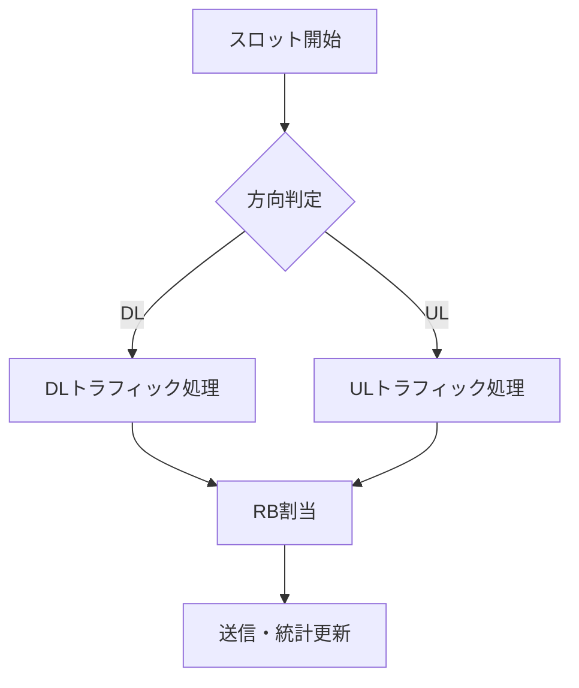

# 周波数軸ラウンドロビンスケジューリング

## 概要

各セルにおいて、割り当てられた RB を接続中の UE に周波数方向に順番に割り当てるスケジューリング方式。

---

## アルゴリズム

### 入力

| 記号            | 説明                                   |
| :-------------- | :------------------------------------- | ----------- | ------------------- |
| $\mathcal{U}$   | 接続中の UE 集合（$                    | \mathcal{U} | = N\_{UE}^{cell}$） |
| $N_{RB}^{cell}$ | セルに割り当てられた RB 数             |
| $i_{last}$      | 前回最後に割り当てた UE のインデックス |

### 処理

```
i ← i_last
for rb = 0 to N_RB^cell - 1 do
    UE_id ← U[i mod N_UE^cell]
    allocate(rb, UE_id)
    i ← i + 1
end for
i_last ← i mod N_UE^cell
```

### 出力

- 各 RB に割り当てられた UE ID
- 更新された$i_{last}$

---

## 特徴

| 項目       | 説明                     |
| :--------- | :----------------------- |
| 公平性     | 全 UE に均等に RB を割当 |
| 計算コスト | O(N_RB)                  |
| 状態       | $i_{last}$のみ保持       |

---

## 例

UE = {0, 1, 2}、RB 数 = 5、$i_{last}$ = 0 の場合:

| RB  | 割当 UE |
| :-- | :------ |
| 0   | UE 0    |
| 1   | UE 1    |
| 2   | UE 2    |
| 3   | UE 0    |
| 4   | UE 1    |

次回の$i_{last}$ = 2

---

## 実装

```rust
pub struct FrequencyRoundRobinScheduler {
    last_ue_index: RefCell<usize>,
}

impl Scheduler for FrequencyRoundRobinScheduler {
    fn schedule(&self, allocated_rbs: u32, ue_ids: &[u32]) -> ScheduleResult {
        let mut result = HashMap::new();
        let num_ues = ue_ids.len();
        let mut current_index = *self.last_ue_index.borrow();

        for rb_id in 0..allocated_rbs {
            let ue_id = ue_ids[current_index % num_ues];
            result.entry(ue_id).or_default().push(rb_id);
            current_index += 1;
        }

        *self.last_ue_index.borrow_mut() = current_index % num_ues;
        result
    }
}
```

---

## Scheduler トレイト

```rust
/// スケジューラトレイト
pub trait Scheduler {
    fn schedule(&self, allocated_rbs: u32, ue_ids: &[u32]) -> HashMap<u32, Vec<u32>>;
}
```

---

## TDD スロット方向

各スロットは DL または UL のいずれかとして処理される。

### スロット方向判定

```rust
#[derive(Debug, Clone, Copy, PartialEq)]
pub enum SlotDirection {
    Downlink,
    Uplink,
}

impl SimulationConfig {
    /// 指定スロットの方向を取得
    pub fn slot_direction(&self, slot: u64) -> SlotDirection {
        match self.tdd_pattern.as_str() {
            "DU" => if slot % 2 == 0 { Downlink } else { Uplink },
            _ => Downlink, // デフォルトは全てDL
        }
    }
}
```

### スケジューリングフロー


